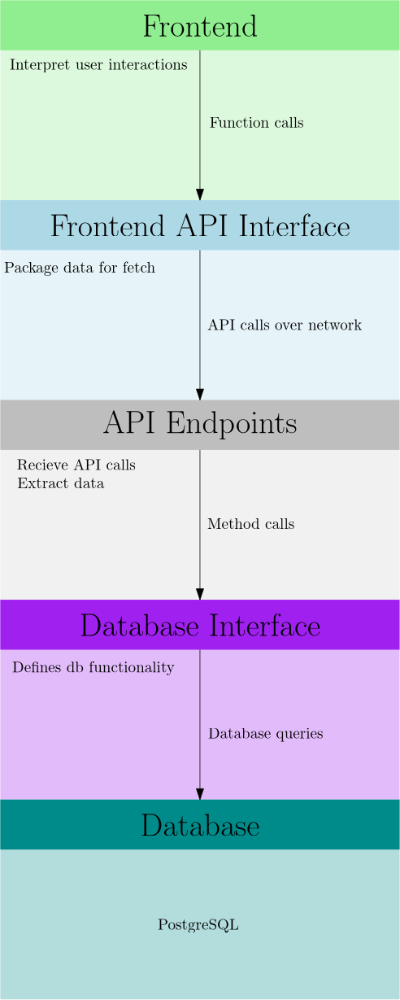

# OneChurch - System Architecture

## Layers of Abstraction

| Layer | Purpose | Code Location |
|---|---|---|
| Presentation | User interface and interaction | `frontend/src/`|
| Frontend API Interface | API calls on frontend| `frontend/src/api/api.js` |
| API Routing | Routes API calls to appropriate handlers | `backend/api/urls.js` |
| API Endpoints | Handles requests and responses | `backend/api/views.py` |
| Database Interface | Interface used by backend to access database | `backend/database/database.py`|
| Database | Structured data storage| `backend/database/postgres.py`|

Any change to an API call involves editing all of the above layers.

## System Design Principles

* **Strict Separation of Concerns**: Each layer has a distinct role - changes in one layer do not affect others
  * A layer does not need to know anything about the implementation of other layers - only the interface with the layer above it
* **Modularity**: Each layer is modular, allowing for independent development and testing
  * Each layer can be developed, tested, deployed, maintained, and scaled independently
* **Data Transfer Minimization**: Only necessary data is transferred between layers
  * All logic is performed at the lowest possible layer
  * For example, if the frontend were to request a list of all users and perform search locally, this would require massive data transfer over the network. Instead, the frontend sends the search query to the backend, and the backend performs the search in the database, returning only the results.

